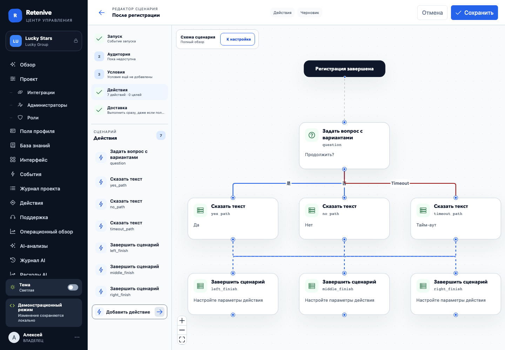
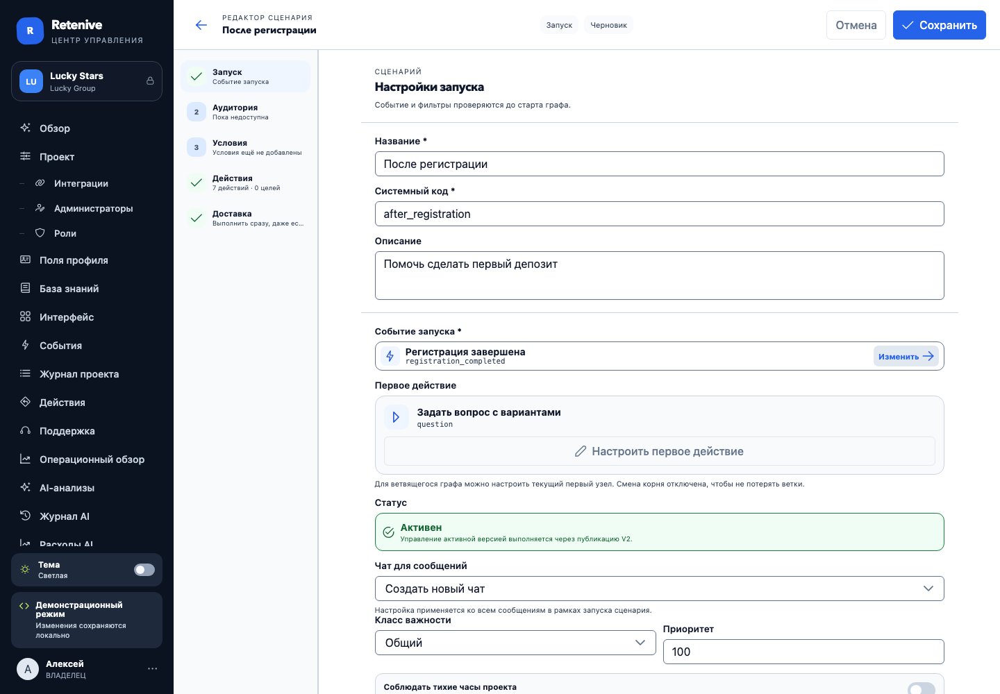

# UX/UI-аудит редактора сценариев и графа действий

Дата: 9 августа 2026 года.

## Резюме

Главная проблема подтверждена: текущий canvas правильно отображает небольшой линейный сценарий, но не является надёжным представлением сложного DAG. Он раскладывает узлы по глубине и порядку в `form.actions`, не минимизирует пересечения, выводит все ветки из одного порта и не учитывает размеры подписей. В минимальном сценарии «вопрос → Да / Нет / тайм-аут → три продолжения» ветки меняются сторонами, линии пересекаются, а подписи накладываются на общий маршрут.

Смешение языков также воспроизведено. Для локализованного значения берётся первая запись объекта, а не текущая/default locale; системная timeout-ветка дополнительно жёстко подписана как `Timeout`.

Перетаскивание узлов можно включить безопасно, если оно меняет только отдельное presentation-состояние. Свободное переподключение рёбер включать вместе с ним нельзя: это уже изменение исполняемой семантики.

Проблема первого действия в текущей ветке частично исправлена: есть «Настроить первое действие», а линейному графу доступно «Сделать первым». Но операция смены корня вращает всю цепочку, ветвящийся root менять нельзя, а замена типа первого узла без preview сбрасывает его переход. Это требует безопасной продуктовой операции, а не простого снятия ограничений.

## Как проверялось

- Запущен frontend в demo-режиме на `127.0.0.1:4173`.
- Проверен реальный desktop UI нового сценария и существующего сценария.
- Прогнан существующий e2e action editor.
- Собран минимальный fixture из 7 узлов с тремя исходами вопроса и намеренно переставленными продолжениями.
- Отдельно проверены локализованные labels с порядком `zh → ru`.
- Проверены модель и страница: 52 unit/component tests прошли.

Команды:

```bash
npx playwright test e2e/operator-journeys.spec.ts --project=chromium --grep "action editor gives configuration"
npx playwright test e2e/operator-journeys.spec.ts --project=chromium --grep "temporary audit captures"
npx vitest run src/features/scenarios/model/scenario-graph.test.ts src/pages/ScenarioEditorPage.test.ts
```

Временный e2e-fixture после получения доказательств удалён; в репозитории оставлены только скриншоты.

## Визуальные доказательства

### Сложный граф



На скриншоте одновременно видны четыре дефекта:

1. ветка `yes_path` уходит к правому `right_finish`, а `no_path` — к левому `left_finish`, поэтому линии меняются сторонами;
2. три исхода используют один source handle и общий горизонтальный участок;
3. подписи `是`, `否` и `Timeout` оказываются на линии и около пересечения;
4. второй уровень графа выглядит как единая «шина», поэтому связь приходится восстанавливать глазами.

### Первое действие



В текущей ветке первое действие уже можно открыть и настроить. Для ветвящегося графа выбор другого root отключён с объяснением. Значит, исходный пользовательский симптом нельзя считать полностью актуальным для этой версии frontend; остаётся нерешённой безопасная смена root и понятный versioned flow опубликованного сценария.

## Причины в коде

### P0 — неверная локаль и английский timeout

- `localizedText()` возвращает `Object.values(...)[0]`, не зная default/current locale: `src/features/scenarios/model/scenario-graph.ts:41`.
- timeout для `ASK_CHOICE` подписан литералом `Timeout`: `src/features/scenarios/model/scenario-graph.ts:153`.
- При одинаковой цели ответа и timeout создаются два одинаковых source-target маршрута; offset для parallel edges отсутствует.

Решение:

- передавать в graph adapter эффективную locale и общий localization resolver;
- системные ключи `timeout`, `fallback`, `goal`, `goal-timeout` переводить централизованно;
- добавить `branchId`, не зависящий от текста: `choice:<optionId>`, `timeout`, `fallback`;
- параллельные рёбра разводить по отдельным портам/маршрутам.

### P0 — layout не решает задачу DAG

- Глубина вычисляется вручную, а порядок узлов внутри уровня наследуется из `form.actions`: `src/pages/ScenarioEditorPage.vue:803`.
- Координаты — фиксированная сетка `280 × 190`: `src/pages/ScenarioEditorPage.vue:846`.
- Crossing minimization, split/join symmetry, размеры label и edge routing отсутствуют.

Решение: адаптер `scenario graph → ELK graph → Vue Flow`, алгоритм ELK Layered, ортогональные edges, реальные размеры node/label, фиксированный semantic port order.

### P0 — у узла только один вход и один выход

`ScenarioFlowNode` создаёт один target сверху и один source снизу: `src/features/scenarios/ScenarioFlowNode.vue:18` и `:25`. Поэтому «Да / Нет / Тайм-аут» не имеют собственного геометрического места.

Решение:

- отдельный source port для каждого option и отдельный timeout port;
- стабильный порядок: options в порядке конфигурации, затем timeout;
- label-chip рядом с исходным портом;
- timeout отличать иконкой/штрихом, а не только красным цветом.

### P0 — тесты не защищают топологическую читаемость

Существующие e2e проверяют видимость, размеры и overflow, но не пересечения, порядок веток и overlap labels.

Нужны fixtures:

- `Да / Нет / Тайм-аут`, включая две ветки в одну цель;
- split → независимые цепочки → join;
- вложенные вопросы;
- 30–50 узлов;
- длинные русские labels и несколько locale;
- стабильность координат после повторного layout.

Автоматические инварианты: нет overlap узлов; нет label-node overlap; порядок портов стабилен; повторный layout детерминирован; число crossing не растёт на эталонных fixtures.

### P0 — семантика первого действия недостаточно безопасна

Текущее состояние:

- control и «Настроить первое действие» существуют: `src/pages/ScenarioEditorPage.vue:2733`;
- ветвящийся root намеренно не переназначается: `:2768`;
- линейная операция `changeFirstAction()` вызывает rotation: `:1536`;
- тест фиксирует результат `B → C → A`, когда пользователь выбирает `B` вместо `A`: `src/pages/ScenarioEditorPage.test.ts:894`;
- замена типа узла без preview обнуляет `nextNodeKey`: `src/pages/ScenarioEditorPage.vue:1548`.

Проблема: «сделать B первым» не должно незаметно превращать старый префикс `A` в хвост после `C`. А «заменить тип» не должно молча терять исходящий переход и делать ветки недостижимыми.

Решение разделить на две команды:

1. **«Заменить первое действие»** — оставить identity/root, создать config нового типа, показать несовместимые поля и сохранить переходы, если новый тип их поддерживает.
2. **«Начинать с другого шага»** — показать impact preview: какие узлы станут недостижимы, какие связи будут переписаны, что будет удалено/отсоединено. Применять атомарно только к черновику.

Для опубликованного сценария действие должно называться **«Создать черновик изменений»**. Архивирование не должно быть способом редактирования. Новые запуски после публикации используют новую версию; активные продолжают старую. Миграция активных запусков — отдельная операция.

## Можно ли безопасно двигать узлы

Да, при жёстком разделении двух моделей:

- `form.actions` — исполняемый DAG, не меняется от drag;
- `graphLayout` — координаты, viewport, manual pins, не попадает в scenario runtime payload.

Предлагаемый контракт:

```ts
type ScenarioGraphLayout = {
  mode: 'auto' | 'manual'
  nodes: Record<string, { x: number; y: number; pinned?: boolean }>
  viewport?: { x: number; y: number; zoom: number }
  layoutVersion: 1
}
```

Правила:

- drag включён только в режиме «Ручная раскладка»;
- pan/zoom доступны всегда, включая read-only;
- свободный reconnect edges остаётся выключен;
- «Выровнять автоматически» явно сбрасывает ручные координаты;
- добавление узла использует incremental layout и не двигает весь экран без команды;
- если координаты нужно разделять между администраторами, хранить их отдельным versioned UI-layout документом; если это личное удобство — локально по `scenarioId + revisionId`;
- доступная альтернатива drag: auto-layout и команды перемещения/выравнивания.

## UX/UI-аудит по разделам

### Запуск

Сильная сторона: metadata, событие и первое действие собраны в одном понятном потоке. Проблема: изменение root визуально живёт в «Запуске», а редактирование содержимого — в «Действиях»; пользователю трудно различить эти две операции.

Доработки:

- назвать блок «Точка входа»;
- рядом с первым узлом дать две явные команды: «Настроить шаг» и, когда безопасно, «Изменить точку входа»;
- показывать влияние на новые/активные запуски до сохранения опубликованного сценария.

### Действия

Текущий desktop отдаёт конфигурации верхнюю область, а графу — нижние 34%. Для одного узла это удобно, для разветвления граф слишком мал; приходится разворачивать и терять inspector-контекст.

Доработки:

- основной режим сложного сценария: canvas как focal area, inspector как правый drawer/panel;
- выбор node не должен закрывать полный обзор и сбрасывать viewport;
- левый список превратить в навигационный outline с поиском, error badges и «к выбранному узлу», а не в параллельное представление маршрута;
- в карточке node показывать тип шага, короткое бизнес-резюме, состояние и количество выходов; технический `nodeKey` сделать metadata;
- различать `action`, `decision`, `wait`, `terminal` формой/иконкой и структурой, а не множеством цветов;
- формы типовых действий группировать как «Что сделать», «С чем», «Куда дальше»; сложные технические поля убирать в «Дополнительно»;
- замена типа должна иметь impact preview и undo.

### Доставка и публикация

Сильная сторона: версия, серверная проверка и история уже разделены. Проблемы: в ARIA/тестовом контракте осталось `immutable revision`, история и восстановление используют техническую лексику, а явного top-level «Создать черновик изменений» для read-only опубликованной версии нет.

Доработки:

- пользовательские labels полностью по-русски: «Опубликовать версию», «Создать черновик изменений», «Создать новую версию на основе…»;
- summary перед публикацией: точка входа, число действий/веток, доставка, аудитория, условия, предупреждения;
- после публикации явно написать, что изменится для новых и активных запусков;
- восстановление версии отделить от редактирования текущего черновика.

### Mobile

Текущий fallback со списком действий — правильное направление: редактирование не зависит только от drag. Полный граф на телефоне лучше оставить обзорным.

Доработки:

- list-first editing;
- полноэкранный read-only graph с pan/zoom/fit;
- явная кнопка возврата к выбранному шагу;
- не пытаться переносить desktop manual layout на телефон как основной способ работы.

## Навигация большого графа

P1:

- minimap для графов выше порога;
- zoom percentage и reset 100%;
- fit whole graph / fit branch / center selected;
- поиск по названию и `nodeKey`;
- breadcrumbs выделенной ветки;
- сохранение viewport между inspector-переходами;
- legend только если визуальная грамматика не читается сама.

## Визуальное направление

Domain: оркестрация, событие, действие, ожидание, решение, ветка, тайм-аут, версия, запуск.

Color world: светлый инженерный canvas, графитовые terminal/event узлы, спокойный синий для выбранного маршрута, зелёный только для валидного/успешного, янтарный для ожидания, красный только для ошибки/опасного исхода.

Signature: **маршрутные lanes с подписанными портами** — у decision/wait узла каждый исход начинается с собственного chip и остаётся в своей полосе до join.

Rejecting:

- свободная mind-map раскладка → детерминированный workflow layout;
- одинаковые rounded cards → различимая грамматика action/decision/wait/terminal;
- цвет как единственный смысл → label + icon + line pattern;
- постоянно открытые три равноправные области → canvas как focal point, inspector как контекстный слой.

Direction: спокойный технический workbench. Canvas доминирует, структура почти бесцветна, цвет сообщает состояние и выбранный путь. Плотность остаётся рабочей, но ветвления получают больше пространства, чем линейные участки.

## Приоритетный backlog

| Приоритет | Доработка | Результат |
| --- | --- | --- |
| P0 | Locale-aware branch labels + русский timeout | Нет иероглифов/английского текста |
| P0 | ELK Layered adapter | Минимизация crossing, стабильный DAG |
| P0 | Semantic ports и parallel-edge routing | Читаемые Да/Нет/тайм-аут и общие цели |
| P0 | Complex graph regression fixtures | Дефекты больше не возвращаются |
| P0 | Безопасные операции первого действия | Нет архивации и скрытой порчи маршрута |
| P1 | Auto/manual presentation layout | Безопасный drag узлов |
| P1 | Minimap, center selected, zoom state | Навигация 30–50 узлов |
| P1 | Canvas-first desktop composition | Граф видим во время настройки |
| P1 | Node visual grammar + action form grouping | Быстрее чтение и настройка |
| P1 | Versioned published → draft flow | Понятное редактирование активного сценария |
| P2 | Search, branch focus, polish/motion | Ускорение ежедневной работы |

## Рекомендуемая последовательность реализации

1. Починить локализацию labels и добавить red tests.
2. Ввести graph adapter и semantic ports без изменения backend payload.
3. Подключить ELK Layered и зафиксировать сложные fixtures.
4. Перестроить desktop composition вокруг canvas + inspector.
5. Реализовать безопасное изменение первого действия и versioned draft flow.
6. Добавить manual layout/drag под feature flag.
7. Довести navigation и mobile/read-only режимы.

Первичные источники и техническое обоснование: `docs/research/scenario-graph-layout-and-versioning-primary-sources-2026-08-09.ru.md`.
